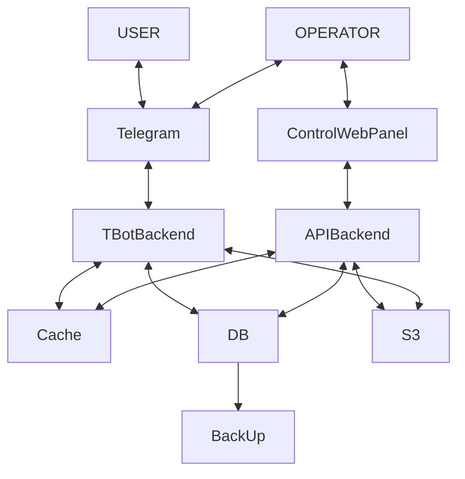

# Подробная схема архитектуры системы автоматизированного бронирования

## 1. Общая схема взаимодействия (уровень 1)

## 2. Детальная архитектура компонентов

### 2.1. Клиентские интерфейсы

**А. Мессенджер‑клиенты (Telegram/WhatsApp)**

* **Чат‑бот:**
  - интерактивное меню с категориями объектов;
  - inline‑клавиатуры для выбора параметров;
  - карточки объектов (до 10 фото, описание, цена);
  - встроенный календарь для выбора дат;
  - статусы бронирований в реальном времени.

**Б. Веб‑панель операторов**

* **Дашборд:** ключевые метрики (загруженность, доходы, новые бронирования);
* **Таблицы данных:** фильтрация/сортировка по: ID, дате, статусу, типу объекта;
* **Формы управления:** CRUD объектов, тарифов, пользователей;
* **Модуль аналитики:** построение графиков, экспорт в Excel/PDF;
* **Логи операций:** аудит изменений с указанием автора и времени.

### 2.2. Промежуточный слой (API Gateway)

* **Функции:**
  - маршрутизация запросов к микросервисам;
  - балансировка нагрузки (Nginx/HAProxy);
  - SSL‑терминация (Let's Encrypt);
  - ограничение частоты запросов (rate limiting);
  - логирование всех входящих/исходящих запросов;
  - обработка CORS для веб‑панели.

### 2.3. Бэкенд (микросервисная платформа)

**Микросервисы и их функции:**

1. **Сервис бронирований (`booking-service`)**

  - валидация доступности объектов по календарю;
  - создание/изменение/отмена бронирований;
  - управление статусами: *ожидает оплаты*, *подтверждено*, *оплачено*, *отменено*;
  - расчёт стоимости с учётом тарифов и дополнительных услуг;
  - интеграция с календарём (Google Calendar API).

2. **Сервис объектов (`objects-service`)**

  - CRUD операций для объектов аренды;
  - управление свойствами (тип, местоположение, фото);
  - фильтрация по параметрам (цена, дата, тип);
  - кэширование популярных объектов в Redis.

3. **Платёжный сервис (`payments-service`)**

  - инициализация платежей через API платёжных систем;
  - обработка веб‑хуков об успешных/неудачных платежах;
  - генерация чеков и квитанций;
  - поддержка валют и налоговых ставок.

4. **Сервис уведомлений (`notifications-service`)**

  - отправка сообщений в мессенджеры (Telegram/WhatsApp);
  - email‑рассылки (через SMTP/SendGrid);
  - push‑уведомления (Firebase Cloud Messaging);
  - шаблоны сообщений для разных статусов.

5. **Сервис аналитики (`analytics-service`)**

  - сбор метрик: количество бронирований, доход, загруженность;
  - построение отчётов (дневных/недельных/месячных);
  - экспорт в Excel/PDF (библиотеки: `xlsxwriter`, `pdfkit`);
  - API для веб‑панели операторов.

6. **Сервис аутентификации (`auth-service`)**

  - регистрация/авторизация пользователей;
  - JWT‑токены с ролевой моделью (пользователь/оператор/администратор);
  - восстановление пароля через email;
  - двухфакторная аутентификация (опционально).

7. **Сервис дополнительных услуг (`addons-service`)**

  - управление списком услуг (например, «грязный приём», «заправим сами»);
  - расчёт стоимости дополнительных опций;
  - привязка к типам объектов.

### 2.4. Хранилища данных

**А. Основная база данных (PostgreSQL 14+)**

* **Схемы и таблицы:**
  - `public.users` (ID, контакты, роль, дата регистрации);
  - `public.objects` (ID, тип, свойства, цена, местоположение);
  - `public.bookings` (ID, объект_ID, даты, статус, сумма);
  - `public.payments` (ID, бронирование_ID, статус, сумма, дата);
  - `public.operators` (ID, права, отдел);
  - `public.addons` (ID, название, цена, типы_объектов).
* **Индексы:** по `bookings.date_start`, `objects.type`, `payments.status`.
* **Триггеры:** аудит изменений в `bookings` и `objects`.

**Б. Кэш (Redis 6+)**

* сессии пользователей (JWT‑токены);
* популярные объекты аренды (TTL 5 мин);
* лимиты rate limiting (IP‑адреса).

**В. Файловое хранилище (S3‑совместимое, например, MinIO)**

* фото объектов (формат: JPEG/PNG, ограничение 5 МБ);
* документы (договоры, чеки, PDF‑отчёты);
* лог‑файлы системы.

### 2.5. Интеграции

* **Мессенджеры:**
  - Telegram Bot API (long polling/webhook);
  - WhatsApp Business API (через провайдера).
* **Платёжные системы:**
  - Яндекс.Касса (REST API);
  - Stripe (API v12+).
* **Календари:** Google Calendar API (синхронизация событий).
* **Аналитика:** Яндекс.Метрика/Google Analytics (события бронирований).
* **Email‑рассылки:** SendGrid/Mailgun (API).

### 2.6. Инфраструктура и DevOps

**А. Серверы и оркестрация**

* облачные инстансы (AWS EC2/GCP Compute Engine/Yandex Cloud);
* оркестрация: Kubernetes (k8s) с Horizontal Pod Autoscaler;
* контейнеры: Docker (образы на базе Alpine Linux).

**Б. Мониторинг и логирование**

* мониторинг: Prometheus + Grafana (метрики CPU/RAM/запросов);
* логи: ELK Stack (Elasticsearch, Logstash, Kibana);
* алерты: Telegram‑бот для критических ошибок.

**В. Резервное копирование**

* БД: ежедневные бэкапы (pg_dump → S3);
* файлы: синхронизация в S3 каждые 4 часа;
* конфигурация k8s: GitOps (ArgoCD).

**Г. CI/CD**

* репозиторий: GitHub;
* пайплайны:
  - сборка Docker‑образов;
  - тестирование (юнит/интеграционные тесты);
  - деплой в k8s (каналы: dev/staging/prod).

## 3. Потоки данных (примеры сценариев)

### 3.1. Бронирование через мессенджер

1. Пользователь выбирает объект в боте → запрос в API Gateway.
2. API Gateway → `objects-service` (проверка доступности).
3. `objects-service` → PostgreSQL (запрос по дате/типу).
4. PostgreSQL → `objects-service` (ответ с данными).
5. `objects-service` → `booking-service` (создание брони).
6. `booking-service` → PostgreSQL (запись в `bookings`).
7. `booking-service` → `payments-service` (инициализация платежа).
8. `payments-service` → платёжная система (редирект пользователя).
9. Платёжная система → `payments-service` (веб‑хук об оплате).
10. `payments-service` → `booking-service` (обновление статуса).
11. `booking-service` → `notifications-service` (уведомление).
12. `notifications-service` → Telegram (сообщение пользователю).

### 3.2. Управление через веб‑панель

1. Оператор изменяет объект в веб‑панели → запрос в API Gateway.
2. API Gateway → `objects-service` (обновление данных).
3. `objects-service` → PostgreSQL (UPDATE в `objects`).
4. `objects-service` → Redis (очистка кэша объекта).
5. Оператор запрашивает отчёт → API Gateway → `analytics-service`.
6. `analytics-service` → PostgreSQL (агрегация данных).
7. `analytics-service` → веб‑панель (отображение отчёта).

## 4. Нефункциональные требования

* **Производительность:**
  - время отклика API ≤ 300 мс (p95);
  - обработка
